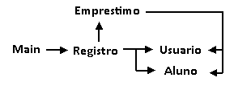

**ATENÇÃO: o código a seguir está bastante simplificado.**

# 1. Defina o que é Orientação a Objetos
A programação orientada a objetos é uma técnica de programação que implementa algoritmos através de estruturas de dados chamadas 'objetos', que podem armazenar dados e comportamentos e interagir entre si. É útil pois pode abstrair códigos ininteligíveis em sentenças simples, como 'Programa.iniciar()'.
	
# 2. Conceitos básicos
**Classe** é o 'tipo' do objeto, é como se fosse a planta baixa do objeto a instanciar.

**Objeto** é uma instância de uma classe. Por exemplo, podemos ter um objeto 'MeuCarro' de classe 'Carro'.

**Atributo** ou propriedade é um valor associado ao objeto, e normalmente está descrito na classe quais atributos o objeto tem ou pode ter. Ex: 'gasolina', 'cor'.

**Método** é um comportamento do objeto, também já descrito na classe. Assim, se trata de uma função armazenada no objeto. Ex: 'acelerar', 'trancar'.
	
# 3. Conceito de classe e um objeto
A classe descreve como um objeto deve ser estruturado: atributos, métodos que deve possuir.
	
### arquivo Carro.java
    public class Carro {
		//diz quais atributos tem.
		double gasolina;
		String cor;
		
		//diz quais métodos tem.
		void acelerar() {}
		void trancar() {}
		
		//esse método, por ser homônimo, descreve a função construtora.
		//a função construtora serve para instanciar o objeto.
		Carro() {}
	}
	
### arquivo Main.java
	public class Main() {
		public static void main() {
			//cria objeto meuCarro de classe Carro.
			meuCarro = new Carro();
		}
	}
	
# 4. Associação entre classes
Se trata da circunstância onde uma classe requer outra classe para funcionar, tal como um carro depende de rodas e motor para funcionar. 
	
Nesse caso, é necessário que se compile os arquivos desde aqueles que não tenham nenhuma dependência, então por através de suas dependências, até finalmente chegar na classe Main, que roda o programa.
	
### arquivo Motor.java
	public class Motor {
	}
	
### arquivo Rodas.java
	public class Rodas {
	}
	
### arquivo Carro.java
	public class Carro {
		///...
		Motor motor;
		Rodas rodas;
	}
	
### arquivo Main.java
	public class Main {
		///...
		Carro meuCarro = new Carro();
	}
	
# 5. Criação de classe simples
### arquivo Apartamento.java
	public class Apartamento {
		public double area;
		public int quartos;
		public int andar;
		public double valorDeCompra;
		public int vagasDeGaragem;
		public boolean temVaranda;
		
		void exibirInfo() {
			System.out.println(area);
			System.out.println(quartos);
			System.out.println(andar);
			System.out.println(valorDeCompra);
			System.out.println(vagasDeGaragem);
			System.out.println(temVaranda);
		}
	}
	
# 6. Herança
É possível fazer com que uma classe herde os atributos e métodos de outra classe, e isso se chama herança. Por exemplo, 'carro' herdaria de 'veículo' pois todo carro é um veículo. Usamos `extends` pra isso.
	
### arquivo Veiculo.java
	public class Veiculo {
		int rodas;
		//...
	}
	
### arquivo Carro.java
	public class Carro.java extends Veiculo.java {
		
		Carro(int _rodas) {
			rodas = _rodas;
			// como Carro herda de Veiculo, o atributo 'rodas' já vem junto e podemos modificar ele sem ter que declarar novamente.
		}
		
		//...
	}
	
# 7. Polimorfismo - Sobrecarga
Podemos definir múltiplas combinações diferentes de parâmetros para métodos de mesmo nome, e isso se chama sobrecarga. Por exemplo, podemos ter três funções 'Soma()' que aceitam os parâmetros 'int A, int B', 'String A, String B' e 'boolean A, boolean B'. O fato de terem parâmetros diferentes já torna as funções distintas uma das outras, embora tenham o mesmo nome.
	
### arquivo Main.java
	public class Main {
		int Soma(int A, int B) {
			return A + B;
		}
		
		String Soma(String A, String B) {
			return A + B;
		}
		
		boolean Soma(boolean A, boolean B) {
			return A && B;
		}
	
		public static void main() {
			System.out.println(Soma(1,3));
			System.out.println(Soma("So", "ma"));
			System.out.println(Soma(true, false));
		}
	}
	
# 8. Polimorfismo - Sobrescrita
Existem ocasiões em que é conveniente fazer com que uma subclasse substitua o comportamento de uma função herdada de sua superclasse, e isso se chama sobrescrita. Além disso, sempre que se realizar a sobrescrita, é necessário adicionar @Override para sinalizar que a função original foi substituída.
	
### arquivo ABC.java
	public class ABC {
		void metodo() {
			System.out.println("ABC");
		}
	}
	
### arquivo DEF.java
	public class DEF extends ABC {
		@Override
		void metodo() {
			System.out.println("DEF");
		}
	}
	
# 9. Encapsulamento
Encapsulamento se trata de realizar o controle da alteração de propriedades de objetos por através de atributos privados (que então não podem ser acessados diretamente por classes exteriores) e métodos getter/setters. Isso garante um comportamento previsível e mais seguro ao interagir com os atributos de um objeto.
	
### arquivo Apartamento.java
	public class Apartamento {
		private double area;
		private int quartos;
		private int andar;
		private double valorDeCompra;
		private int vagasDeGaragem;
		private boolean temVaranda;
		
		void exibirInfo() {
			System.out.println(area);
			System.out.println(quartos);
			System.out.println(andar);
			System.out.println(valorDeCompra);
			System.out.println(vagasDeGaragem);
			System.out.println(temVaranda);
		}
		
		// getters -- leem as propriedades
		double getArea(){return this.area;}
		int getQuartos(){return this.quartos;}
		int getAndar(){return this.andar;}
		double getValorDeCompra(){return this.valorDeCompra;}
		int getVagasDeGaragem(){return this.vagasDeGaragem;}
		boolean getTemVaranda(){return this.temVaranda;}
		
		// setters -- modificam as propriedades
		void setArea(double area){this.area = area;}
		void setQuartos(int quartos){this.quartos = quartos;}
		void setAndar(int andar){this.andar = andar;}
		void setValorDeCompra(double valorDeCompra){this.valorDeCompra = valorDeCompra;}
		void setVagasDeGaragem(int vagasDeGaragem){this.vagasDeGaragem = vagasDeGaragem;}
		void setTemVaranda(boolean temVaranda){this.temVaranda = temVaranda;}
	}
	
# 10. Agregação
Para manusear múltiplos objetos podemos determinar uma classe agregadora, tal como uma classe 'Painel' para gerir objetos de classe 'Botão'. Isso se trata de uma relação de agregação. Vale notar que, embora a classe agregadora contenha esses objetos agregados, os objetos agregados ainda sim podem existir independente de haver ou não uma classe agregadora.
	
### arquivo Botao.java
    public class Botao {
        //...
    }
	
### arquivo Painel.java
    public class Painel {
        Botao[] botoes;

        botoes[botoes.length()] = new Botao();
        botoes[botoes.length()] = new Botao();
        botoes[botoes.length()] = new Botao();

        //...
    }

# 11. Projeto orientado a objetos

### arquivo Livro.java

	public class Livro {
		private String nome;
		private String autor;
		private String genero;
		private int id;
		
		//...
	}

### arquivo Usuario.java

	public class Usuario {
		private String nome;
		private int id;
		
		//...
	}

### arquivo Emprestimo.java

	//agrega Usuario e Livro

	public class Emprestimo {
		private Usuario usuario;
		private Livro livro;
		private double prazo;
		
		//...
	}

### arquivo Registro.java

	para podermos distinguir livros de mesma obra assim como usuários, usamos hashmaps para identificar cada unidade por id.
	import java.util.HashMap;

	public class Registro {
		private HashMap<int, Livro> livros = new HashMap<int, Livro>();
		private HashMap<int, Usuario> usuarios = new HashMap<int, Usuario>();
		private Emprestimo[] emprestimos;
		
		//supomos que o usuario forneça um id único para evitar ter de escrever uma funcao para gerar eles.
		Usuario addUsuario(int id, String nome){
			Usuario newUsuario = new Usuario(id, nome);
			this.usuarios.put(id, newUsuario);
			return newUsuario;
		}
		
		Livro addLivro(int id, String nome, String autor, String genero){
			Livro newLivro = new Livro(id, nome, autor, genero);
			this.livros.put(id, newLivro);
			return newLivro;
		}
		
		Emprestimo addEmprestimo(int idUsuario, int idLivro, double prazo){
			Usuario usuario = this.usuarios.get(idUsuario);
			Livro livro = this.livros.get(idLivro);
			Emprestimo newEmprestimo = new Emprestimo(usuario, livro, prazo);
			return newEmprestimo;
		}
		
		//...
		
	}

### arquivo Main.java